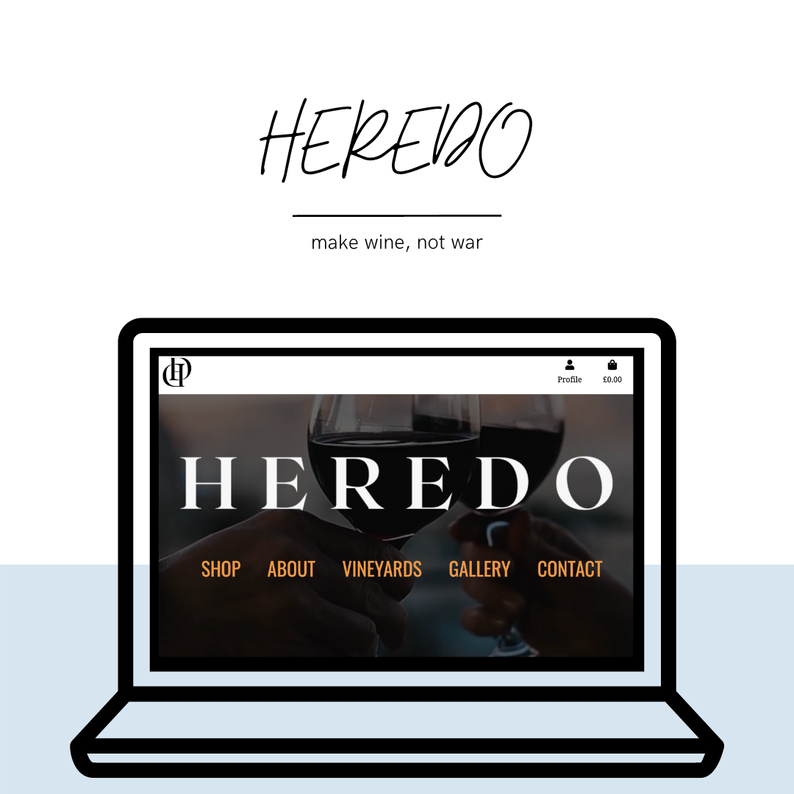

<h1 align=center> HEREDO </h1>

This project is the website for Heredo family, my family's winery founded back in 2000s.  
We officially gave it a name last year and started branding this year. 
 
Heredo is all about wine culture and family heritage. Check it out to find more about our vineyards and buy yourself a bottle or more of good quality organic wine.

 

Live app link [here](https://heredo.herokuapp.com/)

## Table of contents
1. [Introduction](#Introduction)
2. [UX](#UX)
    1. [User Stories](###User Stories)
    3. [Strategy(##Strategy)
    4. [Scope](##Scope)
    5. [Structure](##Structure)
    6. [Skeleton](##Skeleton)
    7. [Surface](##Surface)
3. [Features]
    1. [Existing Features]
    2. [Features to Implement in the future]
4. [Issues and Bugs]
5. [Technologies Used]
     1. [Main Languages Used]
     2. [Additional Languages Used]
     3. [Frameworks, Libraries & Programs Used]
6. [Testing](#Testing)
     1. [Testing.md]
7. [Deployment](#Deployment)
     1. [Deploying on Heroku]
     2. [Forking the Repository]
     3. [Creating a Clone]
8. [Credits]
     1. [Content]
     2. [static/Media]
     3. [Code]
9. [Acknowledgements]

## UX

### User Stories

 As a user, I would like to be able to:  

1. Login/Register to the platform.
2. View all products. 
3. Filter products by wine type, gifts, mistery box.
4. Sort products by category, rating and price. 
5. View a detailed page of each product.
6. Add to cart a desired product.
7. Delete or update quantity of the product in cart. 
8. Checkout safely.
9. Receive order confirmation.

 As a logged user, I would like to be able to:

1. View order history.
2. Update personal details. 

 

 As an admin, I would like to be able to:

1. Add a new product.
2. Delete/Update product.

 

## 1. Strategy

 + **Project Goal**
  
  Create a project that allows its users to view, buy wine, create an account, view order history and have a simple, straightforward experience on Heredo winery's website.

## 2. Scope 

As a project owner, I would like to create :

* a simple, straightforward website with an intuitive UX experience.
* Clear and easy navigation for the user through each of Heredo's features.
* a visually appealing website on all devices.

[Back to top ⇧](#)

## 3. Structure

* The main Navbar  is fixed on top to facilitate Woofme users to navigate easily and pleasantly. 
* Layout is clear to allow Heredo users to navigate easily. 
* Login/Logout/Register options are present on the navbar to ensure that Woofme users can perform each of the actions easily.
* Enabling website admin to add/delete/edit product if logged in. 
* Home page with extra information about the winery and links to access the online store. 
* A secure and straightforward payment system to ensure the user has a pleasant experience when buying our wine.

[Back to top ⇧](#)

## 4. Skeleton

All wireframes are creating using Figma. 

[Back to top ⇧](#)

### 1. "All products" wireframe: 

### 2. "Home-page" wireframe

### 3. "Product detail" wireframe

### 4. "BAG" wireframe

### 4. "Checkout" wireframe

### 6. "Allauth" wireframes

 + Login page:

+ Register page:

[Back to top ⇧](#)

## 5. Surface

* Colors

* Font selection

[Back to top ⇧](#)

## Functional Scope 
**Heredo Flowchart**

**Agile Methodology**

All sprints are described here.

* Sprint 1

  + Base template
  + Setup Allauth

* Sprint 2
  + Setup Home App

  

* Sprint 3
  + Setup Products app
  + Setup Bag app

* Sprint 4
  + Setup Checkout app
  + Setup Profile app
  + Toasts

* Sprint 5

  + Setup Admin profiles: add/update/delete product
  + Setup Real Time Email
  + Heroku Deployment 

* Sprint 6

  + Create final tests + TESTING file
  + README file

[Back to top ⇧](#)

## Features

1. Home Page

2. Products Page

3. Product detail page

4. Admin Product management pages : 
* add product page
* edit product page
* delete product button

[Back to top ⇧](#)

## Future Features

I would like to implement the following features: 

[Back to top ⇧](#)

## Languages Used

## Frameworks, Libraries & Programs Used

[Back to top ⇧](#)

## Testing and Code validation 
All code validation and test details can be found [here](TESTING.md).

## Project Bugs and Solutions:

| Bugs              | Solutions |
| ---               | --------- |
| When deploying, the website CSS and database were failing on Heroku. | Debug Update and transfer all data to Postgres. A model did not have a slug as per old migrations.

[Back to top ⇧](#)

## Deployment 

This App is deployed using Heroku.

Deployment steps 

 
 1. Ensure all apps are listed on requirements.txt. 
 
Command:  ` pip3 freeze > requirements.txt`. 
 
2. Setting up your Heroku
 
  2.1 Login to Heroku and enter your details: 
  command: ` Heroku login -i` 

    
  2.2 Get your app name from Heroku.
    command: `Heroku apps`
    

  2.3 Set the Heroku remote. 
    command: `Heroku git: remote -a woofmeapp`
    

  2.4 Add, commit, and push to GitHub
    command: `git add. && git commit -m "Deploy to Heroku via CLI"`

  2.5 Push to both GitHub and Heroku
    `command: git push origin main`
    `command: git push Heroku main`
       

[Back to top ⇧](#)

# Credits

## Media

+ Some pictures and images used in this project are from [Pexels](https://pexels.com) and some pictures are taken by me personally as this is my sister's winery.

### Work based on other code

[Back to top ⇧](#)

# Acknowledgements

[Back to top ⇧](#)
