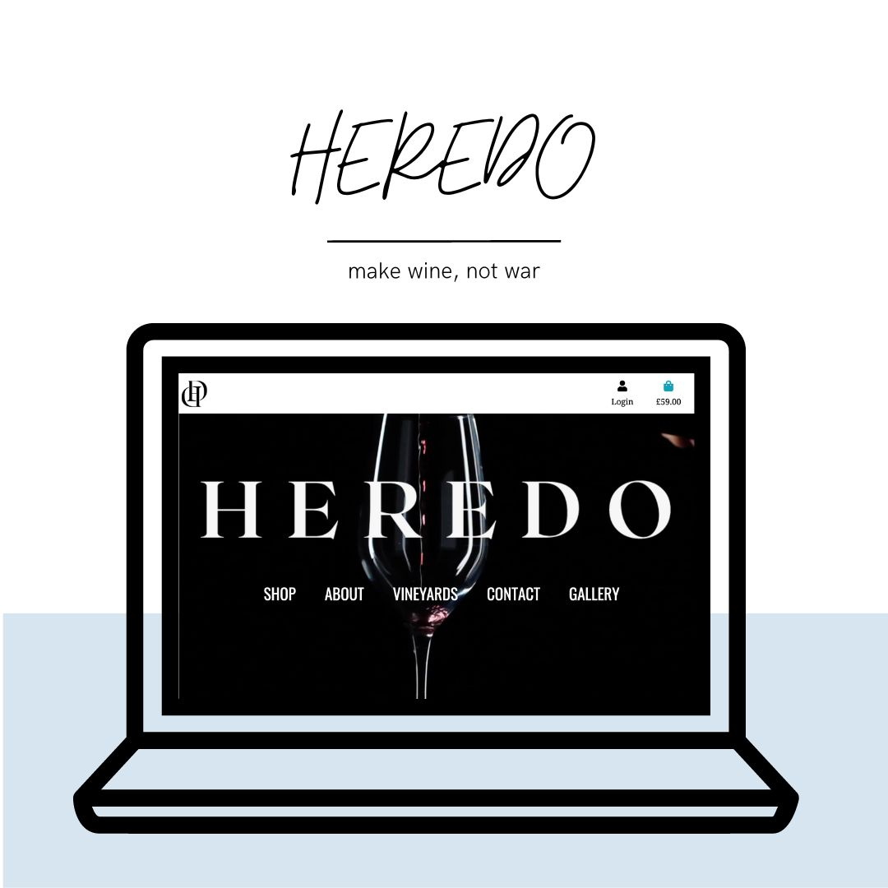
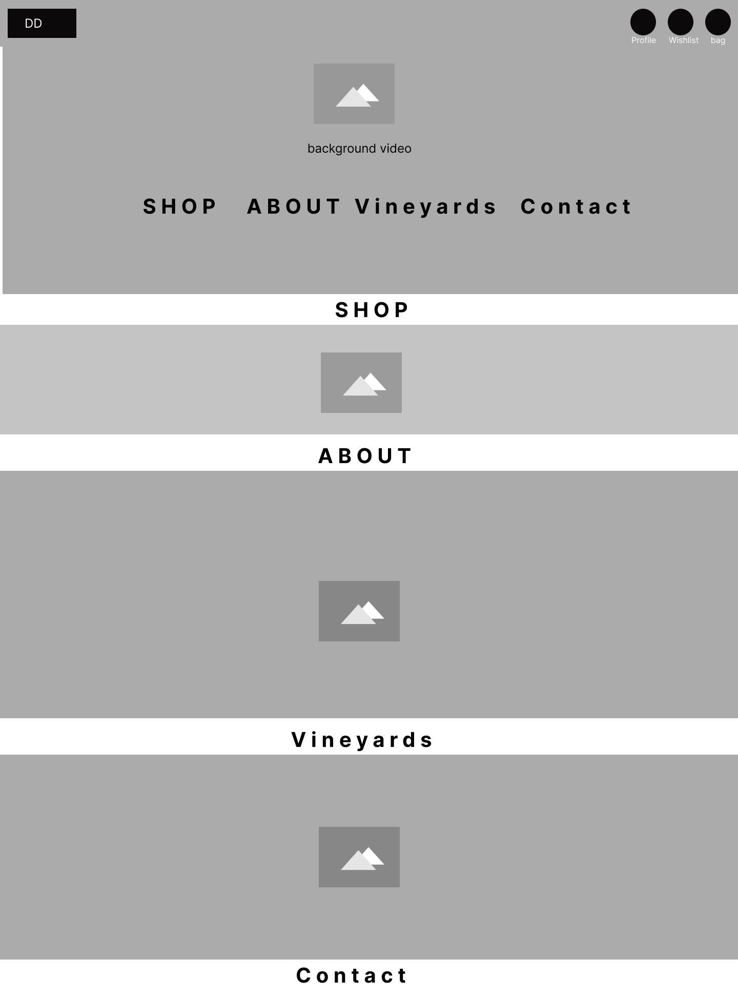
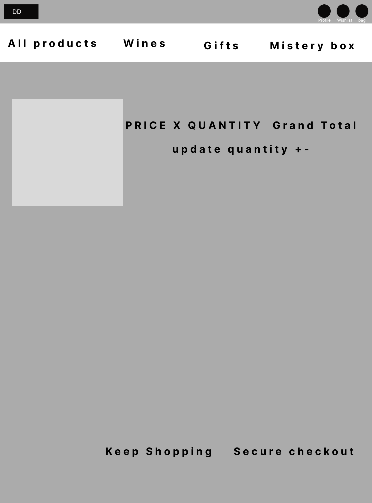
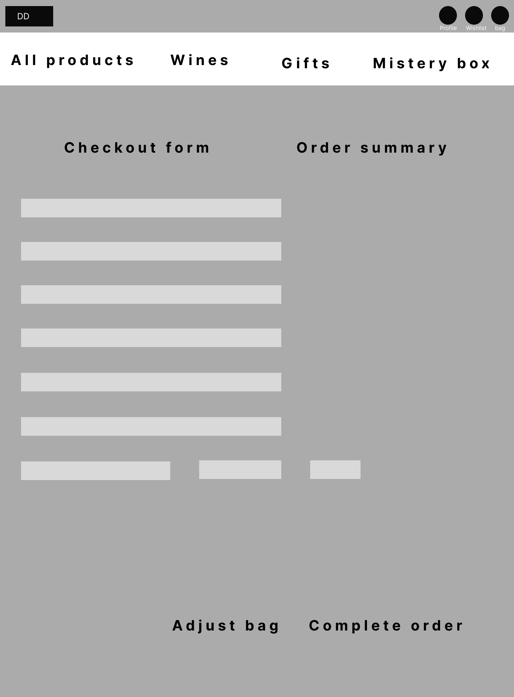
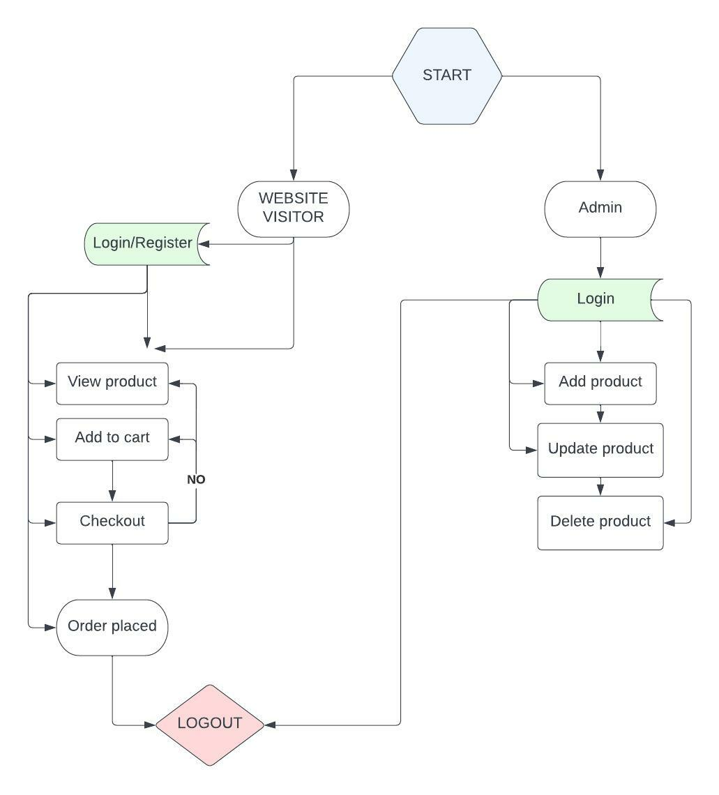

<h1 align=center> HEREDO </h1>


<p align=center>
This project is the website for Heredo family, my family's winery founded back in 2000s. </br>
We officially gave it a name last year and started branding this year. 
Heredo is all about wine culture and family heritage. 
</br>
Check it out to find more about our vineyards and buy yourself a bottle or more of good quality organic wine.

 </p>




Live app link [here](https://heredo.herokuapp.com/)


## Table of contents
1. [Introduction](#Introduction)
2. [UX](#UX)
    1. [User Stories](###User Stories)
    3. [Strategy(##Strategy)
    4. [Scope](##Scope)
    5. [Structure](##Structure)
       1. Existing Features
       2. Potential Features
    6. [Skeleton](##Skeleton)
    7. [Surface](##Surface)
3. [Issues and Bugs]
4. [Technologies Used]
     1. [Frameworks, Libraries & Programs Used]
5. [Testing](#Testing)
     1. [Testing.md]
6. [Deployment](#Deployment)
7. [Credits]
     1. [Content]
     2. [static/Media]
     3. [Code]
8. [Acknowledgements](#Acknowledgements)


## UX


### User Stories

**Epic: Admin/Store Owner**

| ID  | Content                                                                                                                                                   |
| --- | --------------------------------------------------------------------------------------------------------------------------------------------------------- |
| 1   | As a **store owner** I can log in so that I have full access to the store backend                                                                         |
| 2   | As a **store owner** I can add new product to the shop so that I can make sure the website is up to date                                                  |                                            |
| 3   | As a **store owner** I can edit/delete products so that I can make sure the website is up to date                                                         |                                                             | 4   | As a **store owner** I have created Facebook shop page to increase traffic on my website                                                                  |
| 10  | As a **store owner** I can read and respond to users questions sent by contact form                                                                       |

**Epic: Navigation**

| ID  | Content                                                                                                                      |
| --- | ---------------------------------------------------------------------------------------------------------------------------- |
| 12  | As a **user** I can see an interesting home page so that I can understand what shop sells                                    |
| 13  | As a **user** I can easily navigate through the site so that I can view desired content                                      |
| 14  | As a **user** I can easily find a navigation bar and footer so that I can see what content there is on the website           |
| 15  | Aa a **user** I can easily see the products list so that I can see what the store has to offer                               |
| 16  | As a **user** I can sort products by rating, price and category so that I can easily find what I'm looking for                   |
| 17  | As a **user** I can see the product details page so that I can see its name, rating, price, short description, year of harvest and ratings  |


**Epic: Purchase**
| ID | Content |
| --- | ----------- |
| 18 | As a **user** I can increase/decrease the quantity of the desired product.|
| 19 | As a **user** I can add a selected products into the shopping bag.|
| 20 | As a **user** I can see the shopping bag summary and total cost.|
| 21 | As a **user** I can remove items from shopping bag.|
| 22 | As a **user** I can put in my card details.|
| 23 | As a **user** I receive order confirmations on the email.|

**Epic: User Interaction**

| ID  | Content                                                                                                                                |
| --- | -------------------------------------------------------------------------------------------------------------------------------------- |
| 24 | As a **user** I get alerts about any changes I have made so that I have a clear understanding of what has been completed/updated/removed      |
| 25  | As a **user** I can connect to the social media sites so that I can follow them and keep up to date with their products and promotions |
| 26  | As a **user** I can contact the bookstore so that I can find out any information that I require                                        |
| 27 | As a **user** I can receive a contact confirmation email to let me know that my email has been sent                                    |
| 38  | As a **logged-in User** I can save selected products to my whishlist for later purchase                                                |


**Epic: Accounts**

| ID  | Content                                                                                                                  |
| --- | ------------------------------------------------------------------------------------------------------------------------ |
| 29  | As a **user** I can easily see if I'm logged-in or logged-out so that I can be sure what my status is                    |
| 30  | As a **user** I can log in/out off my account if I wish so that I can connect or disconnect from the website             |
| 31 | As a **user** I can register for an account so that I can use features for logged-in users                               |
| 32  | As a **user** I can receive a confirmation email when creating an account so that I know the registration was successful |
| 33  | As a **logged-in User** I can have my details saved so that I don't have to retype my address every time                 |

## 1. Strategy

 + **Project Goal**
  
  Create a project that allows its users to view, buy wine, create an account, view order history and have a simple, straightforward experience on Heredo winery's website.


## 2. Scope 

As a project owner, I would like to create :

* a simple, straightforward website with an intuitive UX experience.
* Clear and easy navigation for the user through each of Heredo's features.
* a visually appealing website on all devices.


[Back to top ⇧](#)

## 3. Structure


### **Home Page**

_Navigation bar - scroll down:_

- The home page navigation menu is present on the hero section of the home page. It has scroll-links for the sections below.
- Navigation bar has links for SHOP, ABOUT, VINEYARDS, CONTACT, GALLERY sections below.


<p align="center">

</p>


_Navigation bar- header:_

1. _Account - Login/Register:_

- The Login/Register feature is located in the upper right corner and offers the user to log in or register for an account as well as log out of the site
- When the user is logged in links for 'Login' and 'Register' will change to 'My Profile', 'Logout' and Wishlist.
- The admin user has extra access that allow them to add, update and remove products from the store and also questions in the FAQ.

<p align="center">

</p>


2. _Shopping bag:_

- The bag is also situated on the top right corner of the site and it is always visible for the user throughout all the pages. With one click they can access their shopping bag to see what is in there, update quantity or remove product from cart.
- The navbar is fully responsive.

<p align="center">

</p>


_Footer:_

- Appears on every page and contains Social links, FAQ quick link.
- Social links are opened in a new tab to avoid dragging users from our site


<p align="center">

</p>

### **User Profile**

- A logged-in user can access the My account link, this page displayed links to personal details and previous orders.
- The personal details page is where the user can update their default shipping/billing address, change email address and password
- The previous order displays a list of all the orders previously made by the user

<p align="center">

</p>


### **Wishlist**

- Wishlist displays the list of items the user has saved to their wishlist, with the ability to remove the product

<p align="center">

</p>


### **Admin**

- Admin can preform full CRUD functionalliy without having to enter the default 'admin panel' from django
- Admin can add Products from 'Products Managment' link in the account menu from the navigation bar
- Admin can add FAQ's from 'FAQ's' link
- Admin can edit/delete products from all products page and product details page
- Admin can edit/delete FAQ from 'FAQ Managemnt' and FAQ's page.
- Admin can mark Questions from FAQ as published or draft

<p align="center">

</p>


### **All Products**

- The All Products page shows all the products in Heredo store.
- Each product has an image, year of harvest, rating and price, description.
- Each product card is clickable and takes users to the product details page

<p align="center">

</p>


### **Shop navbar**

- All products, Wines, Gifts, Mistery box
- Wines: Red wine, White and Rosé, Sparkling and Champagne
- Gifts : Gift cards, Gifts
- Mistery box

### **Product Details Page**

- The Product Details Page displays all the information about the product
- Page main body of the page will display image, description, year of harvest, price, rating, name.
- After the main body content user can select quantity and add it to the shopping bag or wishlist

<p align="center">

</p>

### **Checkout Page**

- Once the site users have made their last decision about what to purchase and they are happy with it. At the checkout the site user can enter and save their personal details and see a summary of what they are about to purchase before entering their card details
- If the checkout was successful the user is taken to the 'payment success' page, which displays the order number and delivery details. They should also get an email.

<p align="center">

</p>

### **Shopping Bag**

- The shopping bag page provides an overview of all of the items added by the user
- The information is displayed in a table that has product name, image, quantity, price and subtotal
- The user can amend the quantity of each product and also remove it from this page
- Buttons to proceed to the checkout or to back to shop are located at the end of the page

<p align="center">

</p>


## Future Features

- Add review system
- Stock app
- Social accounts sign-on

[Back to top ⇧](#)

## 4. Skeleton

All wireframes are creating using Figma. 


[Back to top ⇧](#)

### 1. "All products" wireframe: 


### 2. "Home-page" wireframe




### 3. "Product detail" wireframe


### 4. "BAG" wireframe





### 4. "Checkout" wireframe





### 6. "Allauth" wireframes

 + Login page:


+ Register page:


[Back to top ⇧](#)

## 5. Surface


* Colors


* Font selection


[Back to top ⇧](#)

## Functional Scope 
**Heredo Flowchart**



**Agile Methodology**


<details>
<summary>All sprints are described here.</summary>


* Sprint 1

  + Base template
  + Setup Allauth


* Sprint 2
  + Setup Home App

  

* Sprint 3
  + Setup Products app
  + Setup Bag app


* Sprint 4
  + Setup Checkout app
  + Setup Profile app
  + Toasts


* Sprint 5

  + Setup Admin profiles: add/update/delete product
  + Setup Contact App
  + Heroku Deployment 

* Sprint 6
  + Setup FAQ App
  + Setup Wishlist App

* Sprint 7

  + Create final tests + TESTING file
  + README file

</details>

[Back to top ⇧](#)

## Frameworks, Libraries & Programs Used
[GitHub](https://github.com/) - Holds the repository of my project, GitHub connects to GitPod and Heroku.

[GitPod](https://gitpod.io/workspaces) – Connected to GitHub, GitPod hosted the coding space, allowing the project to be built and then committed to the GitHub repository. 

[AWS](https://aws.amazon.com/) – was used to store static files 

[Heroku](https://www.heroku.com/) - Connected to the GitHub repository, Heroku is a cloud application platform used to deploy this project so the backend language can be utilised/tested. 

[Django](https://www.djangoproject.com/) - This framework was used to build the foundations of this project

[Bootstrap](https://getbootstrap.com/) - Used to quickly add design to my website, Bootstrap focuses on mobile first design meaning this website is responsive across multiple devices ans screen sizes. 

[jQuery](https://jquery.com/) - Used to write JS code

[Gunicorn](https://gunicorn.org/) - Gunicorn is a pure-Python HTTP server for WSGI applications.

[Dj Database URL](https://pypi.org/project/dj-database-url/) - This allows you to utilize the 12factor inspired DATABASE_URL environment variable to configure your Django application.

[Font Awesome](https://fontawesome.com/) -was used for icons.

[Lucid Chart](https://lucidchart.com/) -was used for the flowchart.

[Figma](https://figma.com/) - was used to create site wireframes.

[Google Fonts](https://fonts.google.com/https://fonts.google.com/) - provide fonts for the website.

[Am I Responsive](http://ami.responsivedesign.is/) - to check if the site is responsive on different screen sizes.

[W3C CSS Validator](https://jigsaw.w3.org/css-validator/) - was used to validate CSS


[Back to top ⇧](#)

## Testing and Code validation 
All code validation and test details can be found [here](TESTING.md).

## Project Bugs and Solutions:

| Bugs              | Solutions |
| ---               | --------- |
| When deploying, the website CSS and database were failing on Heroku. | Debug Update and transfer all data to Postgres. A model did not have a field as per old migrations.|
| Wishlist items were not rendering on the wishlist page| |
|

[Back to top ⇧](#)

## Deployment 


### Github

First you will need to create a new repository.

1. Log into Github.
2. On the 'Repositories' tab click 'New'. This takes you to the create a new repository page.
3. Name the repository and click 'Create repository'.
4. Your new repository is now set up and ready to use.


### Django

This project uses the Django framework. To install django, follow these steps:

1. In your IDE type the command:  
    `pip3 install django`
2. Then to name your project type:  
    `django-admin startproject *Your project name here*`  
This will add your django project folder to your file explorer
3. Next you will need to add a gitignore file. To do this enter the command line:  
    `touch .gitignore`
4. Inside this file add these 3 lines:  
    ``` 
    *.sqlite3
    *.pyc
    __pycache__
    ```
5. To check everything is up and running, run the command:  
    `python3 manage.py runserver`
    This should expose port 8000. Open that port and you should be welcomed by Django's success page.
6. Next you need to perform the initial migrations. This is done by running the command:
    `python3 manage.py migrate`
7. Finally, in order to have access to the admin panel you will need to create a superuser. This is done by running the command:
    `python3 manage.py createsuperuser`
    This will then ask you to create a username and password with an optional email address.
8. Once these steps are completed you can push your changes to github by running the commands, in order:
    ```
    git add .
    git commit -m "initial commit"
    git push
    ```

#### All Auth

Inside the django framework is a package called Allauth. This package handles all the registration and sign in processes. The steps to install Allauth can be found [here](https://django-allauth.readthedocs.io/en/latest/installation.html).


### Heroku

Heroku is used to deploy the final project.

1. First you will need to sign in to Heroku. If you do not have an account you can sign up for free [here](https://signup.heroku.com/).
2. Once you are logged in, click the button 'New' and select 'Create new app'.
3. Name the app, then select what region is closest to you and click 'Create App'.
4. Then on the resources tab, navigate to the 'Add-ons' section and search for 'Heroku Postgres'.
5. Select 'Heroku Postgres', then under 'Plan name' choose 'Hobby Dev - Free' and click 'Submit Order Form'.

To use Postgres you will need to install dj_database_url and psycopg2. This should be done in whatever IDE you are using.

1. In your IDE type the command:  
    `pip3 install dj_database_url`
2. Then once that is installed type the command:  
    `pip3 install psycopg2-binary`
3. Then, to make sure Heroku install all your apps requirements when you deploy it, run the command:  
    `pip3 freeze > requirements.txt`
4. Next, navigate to your setting.py file in your main project folder. At the top of the file add the line:  
    ```
    import dj_database_url
    ```
5. Then scroll down the file till you find your database settings. Comment out the default configuration and underneath insert the code:  
    ```
    DATABASES = {
        'default': dj_database_url.parse(*Enter Database URL here*)
    }
    ```
    The database URL can be found in the settings tab of your app in heroku, under Config Vars. Make sure to have the link in quotation marks.  
    **Important!** If you want to migrate any data from your current database to the Postgres database in Heroku, make sure you run this line before connecting to Postgres:  
    `./manage.py dumpdata --exclude auth.permission --exclude contenttypes > db.json`  
6. Once that's saved, you will now need to run migrations because you have connected to a new database. This is done by running the command:  
    `python3 manage.py migrate`
    If you had previously saved your data to import into the postgres database, you can now run the command:  
    `./manage.py loaddata db.json`
7. Now that's setup you will now need to create a superuser for the new database. The command is:  
    `python3 manage.py createsuperuser`
    *Note, once the superuser is created, it's a good idea to sign into the admin panel, locate the user, and check the option that says their email is verified. This is needed otherwise Allauth won't allow the user to sign into the store.* 
8. Before you commit these changes, you will need to remove the Databases section in the settings.py and uncomment the original database. This is to stop your Postgres database URL from ending up in version control.
9. Now we can create an if statement in our settings.py to run the postgres database when using the app on heroku or sqlite if not. Scroll back to the database section and refactor the code to look like this:  
    ```
    if 'DATABASE_URL' in os.environ:
        DATABASES = {
            'default': dj_database_url.parse(os.environ.get('DATABASE_URL'))
        }
    else:
        DATABASES = {
            'default': {
                'ENGINE': 'django.db.backends.sqlite3',
                'NAME': BASE_DIR / 'db.sqlite3',
            }
    }
    ```
10. Next we will have to install another package called gunicorn, which will act as our web server. To do so, run the command:  
    `pip3 install gunicorn`
    And then remember to freeze the requirements with:  
    `pip3 freeze > requirements.txt`
11. Now we can create our Procfile to tell Heroku to create a web dyno. In your root directory create a file named 'Procfile' and inside insert the code:  
    `web: gunicorn **'your_projects_name_here'**.wsgi:application
12. Then, back in heroku, navigate to settings and in the config vars input the key DISABLE_COLLECTSTATIC with the value 1, and click 'Add'.
This is to stop heroku from collecting any static files when you deploy.
13. You will also need to add heroku to your allowed hosts in your settings.py. Back in your project, in the settings file, scroll down to ALLOWED_HOSTS, and inside the brackets insert the url to your app, followed by 'localhost'. It should look something like this:     
    ```
    ALLOWED_HOSTS = ['your-project-name.herokuapp.com', 'localhost']
    ```
14. Now add, commit and push these changes, followed by a push to heroku with the command:  
    `git push heroku main'
    Your app will now be deployed, albeit without any static files, but this will be fixed when setting up AWS, documented below. 
15. If you want your project to be automatically deployed to heroku when pushing your work to github you can. To do so, In heroku go to the deploy tab, and in the 'deployment method' section connect it to github. You will need to search for your repository and once found click 'connect'. Then scroll down and click 'Enable automatic deploys'. Now when you push to github your code will automatically deploy to Heroku as well. 


### AWS

Amazon web services are used to store all our static and media files. 

#### S3

1. First you will need to sign up to AWS which you can do [here](https://aws.amazon.com/).
2. Once you have created an account and logged in, under the All Services>Storage menu, click the link that says S3.
3. On the S3 page you will need to create a new bucket. To do this click the orange button that says 'Create Bucket'.
4. Name the bucket and select the closest region to you. To keep things simple I recommend naming the bucket after your project's name.
5. Under 'Object Ownership' select 'ACLs enabled' and leave the Object Ownership as Bucket owner preferred. 
6. Uncheck the 'Block all public access' checkbox and check the warning box to acknowledge that the bucket will be made public, then click create bucket. 
7. Once created, click the bucket's name and navigate to the properties tab. Scroll to the bottom and under 'Static website hosting' click 'edit' and change the Static website hosting option to 'enabled'. Copy the default values for the index and error documents and click 'save changes'.
8. Now navigate to the permissions tab, scroll down to the Cross-origin resource sharing (CORS) section, click edit and paste in the following code:  
    ```
    [
        {
            "AllowedHeaders": [
            "Authorization"
            ],
            "AllowedMethods": [
            "GET"
            ],
            "AllowedOrigins": [
            "*"
            ],
            "ExposeHeaders": []
        }
    ]
    ```
9. Then scroll back up to the 'Bucket Policy' section. Click 'edit' and then 'Policy generator'. This should open the AWS policy generator page.
10. From here under the 'select type of policy' dropdown menu, select 'S3 Bucket Policy'. Then inside 'Principle' allow all principals by typing a *.
11. From the 'Actions dropdown menu select 'Get object'. Then head back to the previous tab and locate the Bucket ARN number. Copy that, return to the policy generator and paste it in the field labelled Amazon Resource Name (ARN).
12. Once that's completed click 'Add statement', then 'Generate Policy'. Copy the policy that's been generated and paste it into the bucket policy editor.
13. Before you click save, add a '/*' at the end of your resource key. This is to allow access to all resources in this bucket.
14. Once those changes are saved, scroll down to the Access control list (ACL) section and click 'edit'.
15. Next to 'Everyone (public access)', check the 'list' checkbox. This will pop up a warning box that you will also have to check. Once that's done click 'save'. 

#### IAM

1. Now that your bucket is ready we need to create a user to access it. In the search bar at the top of the window, search for IAM and select it.
2. Once on the IAM page, click 'User Groups' from the side bar, then click 'Create group'.
3. Name the group 'manage-*your-project-name*' and click 'Create group' at the bottom of the page. 
4. Then from the sidebar click 'Policies', then 'Create policy'.
5. Go to the JSON tab and click 'import managed policy'. Search for 'S3' and select 'AmazonS3FullAccess' and click import.
6. Once this is imported you will need to edit it slightly. Go back to your bucket and copy your ARN number. Head back to this policy and update the Resource key to include your ARN, and another line with your ARN followed by a /*. It should end up looking something like this: 
    ```
    {
        "Version": "2012-10-17",
        "Statement": [
            {
                "Effect": "Allow",
                "Action": [
                    "s3:*",
                    "s3-object-lambda:*"
                ],
                "Resource": [
                    "YOUR-ARN-NO-HERE",
                    "YOUR-ARN-NO-HERE/*"
                ]
            }
        ]
    }
    ```
7. Click 'Next: Tags', 'Next: Review', and on this page give the policy a name. This could be something as simple as the project name followed by the word policy, and then a short description eg: Access to S3 bucket for 'YOUR PROJECT' static files. Then click 'Create policy'. 
8. This will take you back to the policy page where you should be able to see your newly created policy. Now we need to attach it to the group we created.  
9. Click 'User groups', and click the group you created earlier. Go to the permissions tab and click 'Add permission' and from the dropdown click 'Attach policies'. 
10. Find the policy you just created, select it and click 'Add permissions'.
11. Finally you need to create a user to put in the group. Select users from the sidebar and click 'Add user'.  
12. Give your user a user name, check 'Programmatic Access', then click 'Next: Permissions'. 
13. Select your group that has the policy attached and click 'Next: Tags', 'Next: Review', then 'Create user'.
14. On the next page, download the CSV file. This contains the user's access key and secret access key which you will need later. 

#### Connecting AWS to django

Now that you have created a S3 bucket with its user group attached, we need to connect it to django.

1. First you will need to install two packages. Boto3 and Django storages. Do this by running these commands:  
    ```
    pip3 install boto3
    pip3 install django-storages
    ```
    And remember to freeze the requirements with:  
    ```
    pip3 freeze > requirements.txt
    ```
2. You will then need to add 'storages' to your installed apps section inside your settings.py file. Do that now. 
3. Next, we will need to add some additional settings to the same file to let django know what bucket it's communicating with. 
4. Somewhere near the bottom of the file you should write an if statement to check if there is an environment variable called USE_AWS. This variable does not exist yet but we will add it later. Inside the if statement, write the following settings so it looks like this:  
    ```
    if 'USE_AWS' in os.environ:
        AWS_STORAGE_BUCKET_NAME = 'insert-your-bucket-name-here'
        AWS_S3_REGION_NAME = 'insert-your-region-here'
        AWS_ACCESS_KEY_ID = os.environ.get('AWS_ACCESS_KEY_ID')
        AWS_SECRET_ACCESS_KEY = os.environ.get('AWS_SECRET_ACCESS_KEY')
    ```
5. Next, hop back to heroku and in the settings tab, under config vars, you will need to add some keys with values that were downloaded earlier in the CSV file.
6. Add the key, AWS_ACCESS_KEY_ID with the value that was generated in the CSV file earlier. Then add the key AWS_SECRET_ACCESS_KEY, and again add the value that was generated in the CSV file. Once they have both been added, add the key USE_AWS, and set the value to True.
7. You can now also remove the DISABLE_COLLECTSTAIC variable, since django should now collect static files automatically and upload them to S3.
8. Now head back to the settings.py file in your django project and head back to the if statement we wrote earlier and inside the statement add this line setting:  
    ```
    AWS_S3_CUSTOM_DOMAIN = f'{AWS_STORAGE_BUCKET_NAME}.s3.amazonaws.com'
    ```
    This is to tell django where our static files will be coming from in production.
9. Next we need to create a file to tell django that we want to use S3 to store our static files whenever someone runs collectstatic and also that we want any uploaded product images to go there also.
10. In the root directory of your project create a file called 'custom_storages.py'. Inside this file you will need to import your settings as well as the s3boto3 storage class. So at the top of the file insert the code:  
    ```
    from django.conf import settings
    from storages.backends.s3boto3 import S3Boto3Storage
    ```
11. Then underneath the imports insert these two classes:  
    ```
    class StaticStorage(S3Boto3Storage):
        location = settings.STATICFILES_LOCATION


    class MediaStorage(S3Boto3Storage):
        location = settings.MEDIAFILES_LOCATION
    ```
    The STATICFILES_LOCATION and MEDIAFILES_LOCATION have yet to be defined, so lets do that now.
12. Back in the settings.py file, underneath the bucket config settings but still inside the if statement, add these lines:  
    ```
    STATICFILES_STORAGE = 'custom_storages.StaticStorage'
    STATICFILES_LOCATION = 'static'
    DEFAULT_FILE_STORAGE = 'custom_storages.MediaStorage'
    MEDIAFILES_LOCATION = 'media'
    ```
13. Next, you will also need to override and explicitly set the URLs for static and media files using your custom domain and new locations. To do this add these two lines inside the same if statement:  
    ```
    STATIC_URL = f'https://{AWS_S3_CUSTOM_DOMAIN}/{STATICFILES_LOCATION}/'
    MEDIA_URL = f'https://{AWS_S3_CUSTOM_DOMAIN}/{MEDIAFILES_LOCATION}/'
    ```
14. If you now save, add, commit and push your changes, you should see that your S3 bucket now has a static folder with all your static files inside. Next, we need to handle the Media files but first, inside the if statement add the following code. This helps to speed things up by letting the browser know that its ok to cache static files for a long time:    
    ```
    AWS_S3_OBJECT_PARAMETERS = {
        'Expires': 'Thu, 31 Dec 2099 20:00:00 GMT',
        'CacheControl': 'max-age=94608000',
    }
    ```
15. Back in S3, go to your bucket and click 'Create folder'. Name the folder 'media' and click 'Save'. 
16. Inside the new media folder you just created, click 'Upload', 'Add files', and then select all the images that you are using on your site.
17. Then under 'Permissions' select the option 'Grant public-read access' and click upload. You may need to also check an acknowledgment warning checkbox too. 
18. Once that is finished you're all set. All your static files and media files should be automatically linked from django to your S3 bucket.


### Stripe

Stripe is needed to handle the checkout process when a payment is made. You will need a stripe account which you can sign up for [here](https://stripe.com/en-gb).

#### Payments

1. To set up stripe payments you can follow their guide [here](https://stripe.com/docs/payments/accept-a-payment#web-collect-card-details).

#### Webhooks

1. To set up a webhook, sign into your stripe account and click 'Developers' located in the top right of the navbar.
2. Then in the side-nav under the Developers title, click on 'Webhooks', then 'Add endpoint'.
3. On the next page you will need to input the link to your heroku app followed by /checkout/wh/. It should look something like this:  
    ```
    https://your-app-name.herokuapp.com/checkout/wh/
    ```
4. Then click '+ Select events' and check the 'Select all events' checkbox at the top before clicking 'Add events' at the bottom. Once this is done finish the form by clicking 'Add endpoint'.
5. Your webhook is now created and you should see that it has generated a secret key. You will need this to add to your heroku config vars.
6. Head over to your app in heroku and navigate to the config vars section under settings. You will need the secret key you just generated for your webhook, in addition to your Publishable key and secret key that you can find in the API keys section back in stripe.
7. Add these values under these keys:  
    ```
    STRIPE_PUBLIC_KEY = 'insert your stripe publishable key'
    STRIPE_SECRET_KEY = 'insert your secret key'
    STRIPE_WH_SECRET = 'insert your webhooks secret key'
    ```
8. Finally, back in your setting.py file in django, insert the following near the bottom of the file:  
    ```
    STRIPE_PUBLIC_KEY = os.getenv('STRIPE_PUBLIC_KEY', '')
    STRIPE_SECRET_KEY = os.getenv('STRIPE_SECRET_KEY', '')
    STRIPE_WH_SECRET = os.getenv('STRIPE_WH_SECRET', '')
    ```


[Back to top ⇧](#)

# Credits

## Media

+ Some pictures and images used in this project are from [Pexels](https://pexels.com) and some pictures are taken by me personally.

### Work based on other code


[Back to top ⇧](#)

# Acknowledgements

[Back to top ⇧](#)
