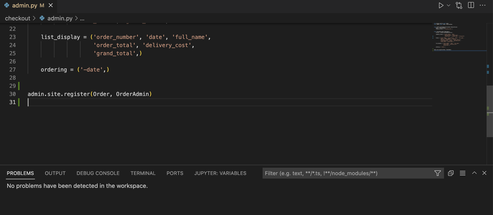
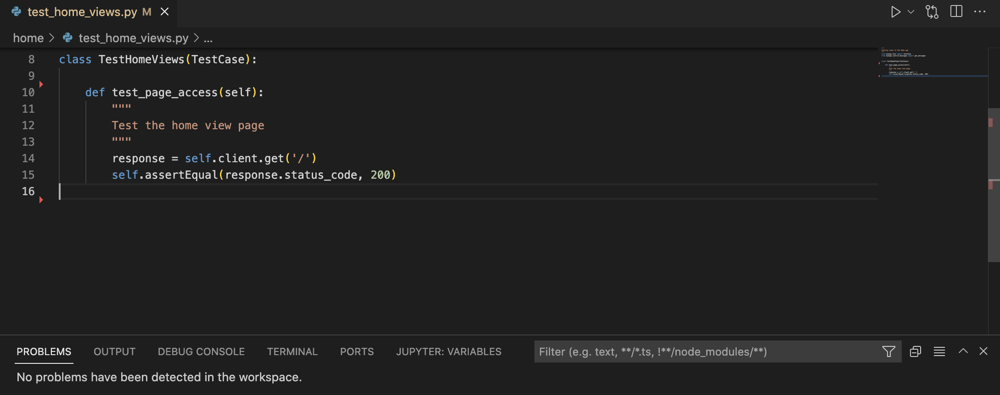
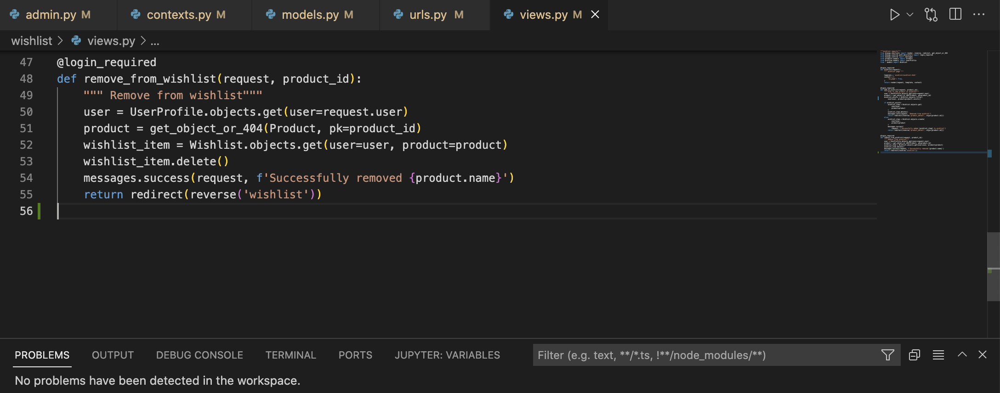

# Testing

During the code development, tests were performed to make sure the functions/views/URLs are running as expected.

Please see below all tests.

## Code Validation Testing

## Automatic tests

### **HEREDO** 
Automated tests were performed on the apps: bag, checkout, home, products, profiles. Please see below: 

========================================================================================

Manual tests were conducted on the other apps and the ones mentioned above too. 

   
## Integration Test Case

+ On this project, the Incremental Testing method was used.

 An incremental testing approach was used for this project to find issues at an early stage and solve them. Please find these tests for each feature below.

### **Navbar**

| Test Case Id | Description | RESULT|
|:----:|:----:|:----:|
| 1 | Click Login navbar button| To be directed to the Login page.|
| 2 | Click the Logo navbar button| To be directed to the home page|
| 3 | Click register navbar button | To be directed to the Register Page|
| 4 | Click bag navbar button | To be directed to the bag page. |

### **Login**

| Test Case Id | Description | RESULT|
|:----:|:----:|:----:|
| 1 | Click sing in button when fields are empty.| To receive an alert for required fields.|
| 2 | Click sign in button when fields are completed| To receive a login-success message.|

### **Register**
| 1 | Click register navbar button | To be directed to the Register Page|
| 2 | Click register button on page when data is invalid| Receive and alert|
| 3 | Click register button on page when data is valid| To be directed to verification email page|
| 4 | Click link in the email .| To be directed to a verify email page|
| 5 | Click verify email button.| To be directed to the login page|

### **Product page**

| 1 | Click card | To be directed to the product detail page|
| 2 | As an admin: click remove button on products | To receive an alert for removed button|
| 3 | As an admin: click update button on products | To receive an alert that you are updating a product and to be redirected to edit product page|

### **Product Detail page**

| 1 | Click add to bag button | To receive an alert that an item is added to bag|
| 2 | Click the increment/decrement icons| To update the quantity.|
| 3 | Click back to shop button| To be directed to the products page|
| 4 | Click add to wishlist button.| To receive and alert than an items is added to the wishlist.|
| 2 | As an admin: click remove button on products | To receive an alert for removed button|
| 3 | As an admin: click update button on products | To receive an alert that you are updating a product and to be redirected to edit product page|

### **Bag**

| 1 | Click update button | To see the quantity updating and receive and alert.|
| 2 | Click remove button| To remove item from bag and receive an alert.|
| 3 | Click Secure Checkout button on bag page| To be directed to the checkout page.|

### **Checkout**

| 1 | Click complete order button when fields are empty.| To receive an alert.|
| 2 | Click Adjust bag button| To be directed to the bag page.|

 ### **Profile**

 | 1 | Click update information button  | To be save the new information|
| 2 | Click order number| To be directer to a order summary page.|
| 3 | Click back to profile button on order summary page.| To be directed to the profile page.|

 ### **Admin Panel**

 | 2 | Click FAQ | To be directed to the FAQ page|

 ### **Admin Product Management Page**
 | 1 | Click products book button | To be directed to the add a product page.|
 | 2 | Click Back to admin Pannel button | To be directed to the admin pannel|

### **Home page navbar and buttons**

| 1 | Click each nav item| To be scrolled down to the section|
| 2 | Click shop and login button on shop section| To be directed to account login and products pages.|
| 3 | Click contact button| To be directed to the contact page|
| 4 | Click faq button| To be directed to the faq page|

### **Shop navbar menu **

| 1 | Click each dropdown button | To collapse dropdown items|
| 2 | Click red wine link| To be rendered only the red wine products| - performed for all wines and gifts|
| 3| Click by price link| To be rendered only the products from cheapest to most expensive|
| 4| Click by rating link| To be rendered only the products from highest to lowest rating|
| 5| Click by category link| To be rendered only the products split according to categories|

### **Footer** 

| Test | Description | RESULT|
|:----:|:----:|:----:|
| 1 | Click on the social media buttons| To be directed to social media pages. |

## Python (PEP8) Validation

###  **Heredo** 

        
        
        

###  **Bag App** 

        
        
        
        
        

### **Checkout** 

        
        
        
        
        
        
        
        
        

### **Home** 

        
        

### **Products** 

        
        

### **Profiles** 

        
        

### **Contact** 

        
        
        
        

### **Wishlist** 

        

### **Questions** 

        

## HTML Code Validation
HTML Validation not perfomed as W3 is not configured for django HTML files and a lot of invalid errors were showing up. However, I manually checked them and made sure formatting is performed and no errors are showing. 

## CSS Code Validation

        

## JavaScript Code Validation

### **add review js** 

        

### **script js** 

        

### **toollip js** 

        

## Exploratory Testing
========================================================================================

### Initial User Testing 

The test user was my friend. I held a test session with herxs and here are the results! 

1. **Home page**

### **Response to the user experience test:**

+ All user feedback was taken into account and incorporated except 

### Final User Testing 

For this test, I have created a checklist for the user which included tests for all features of the pages. Please see the results below: 

        

### **Response to the user test:**

+ All bugs were fixed before submission and suggestions were implemented.

## Manual Testing
========================================================================================

### Desktop
* Google Chrome: everything is working well. All features are functioning, no problems performing all steps of CRUD. 

* Safari: no issues found here in final check.  

### Mobile

* Tested with iPhone 11 PRO and Woofme works well without errors.

### WAVE Accesibility validation

**Home page analysis**

        

**Breed Reviews analysis**

        

**Add review Page analysis**

        

**Login Page analysis**

        

**Register Page  analysis**

        

### Lighthouse validation

**Home page Lighthouse analysis**

        

**Breed Reviews Lighthouse analysis**

        

**Add review Page Lighthouse analysis**

        

**Login Page Lighthouse analysis**

        

**Register Page Lighthouse analysis**

        

# Unfixed bugs

* No unfixed bugs present, only future features that I have tried but not managed to finish: breed groups drop-down menu. Not implemented as decided to do it at a late stage in my project development. Very eager to implement it as soon as my project is graded.
